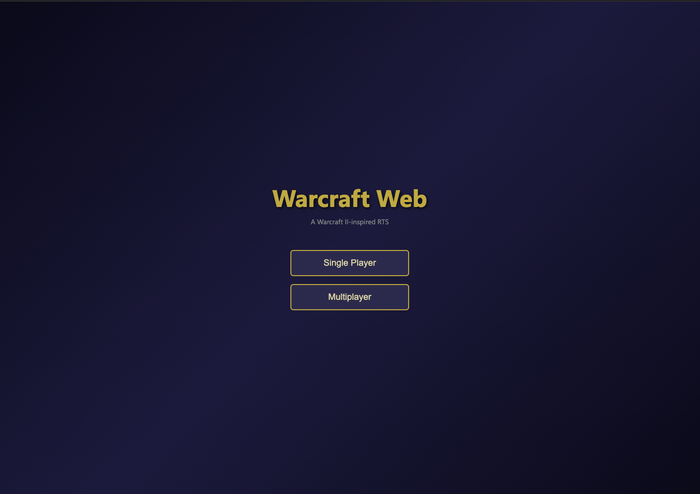
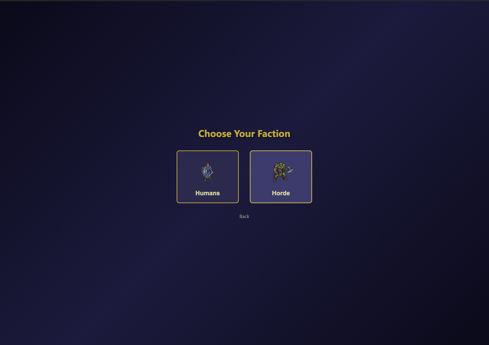
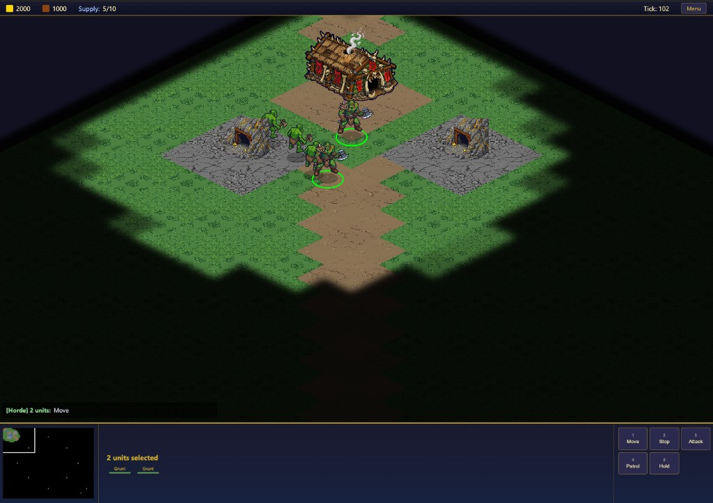
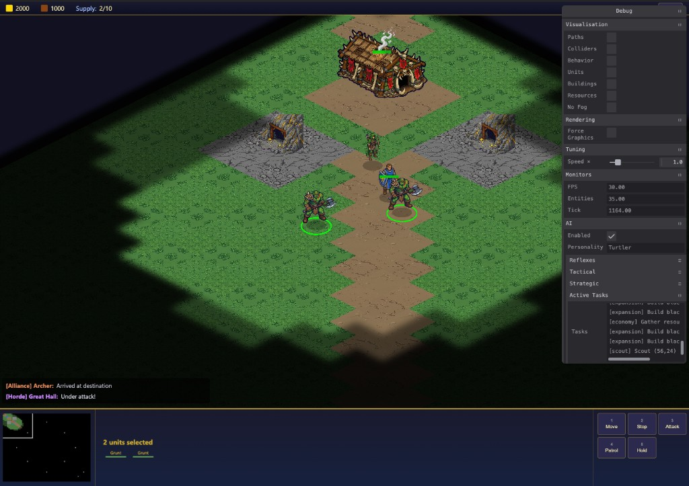
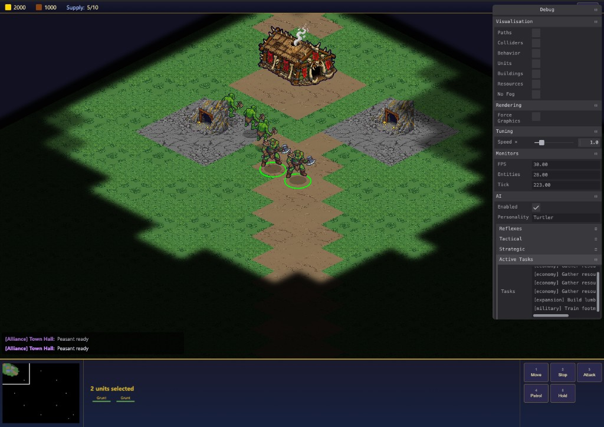
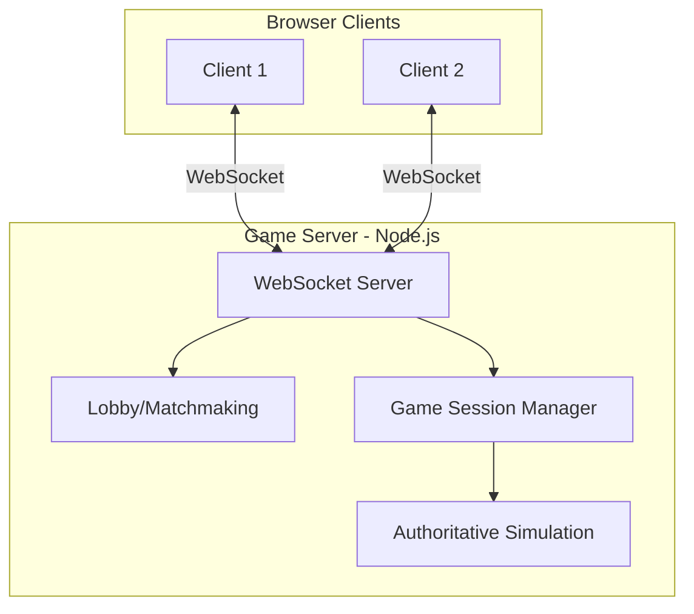
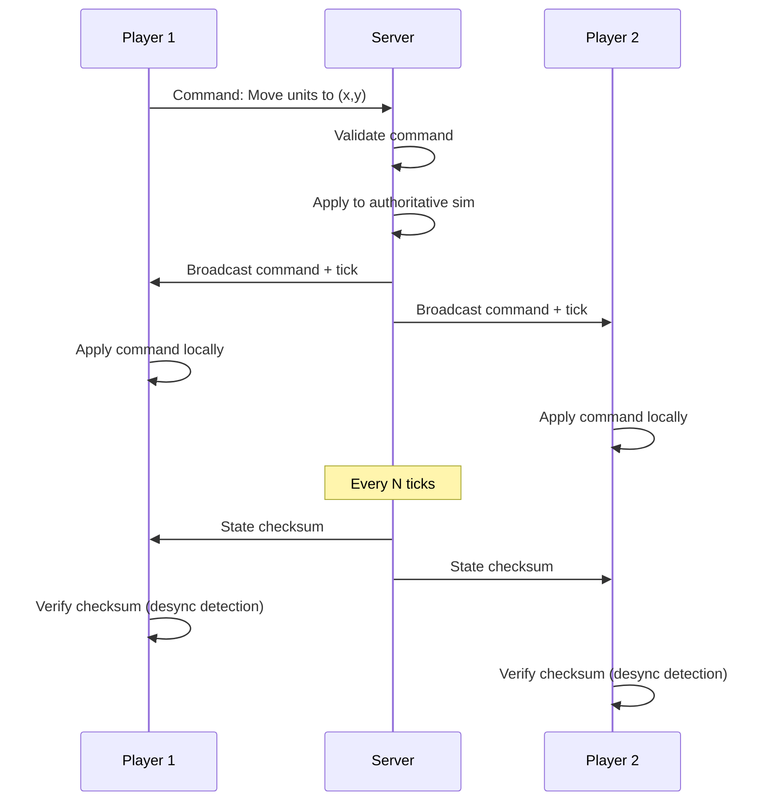
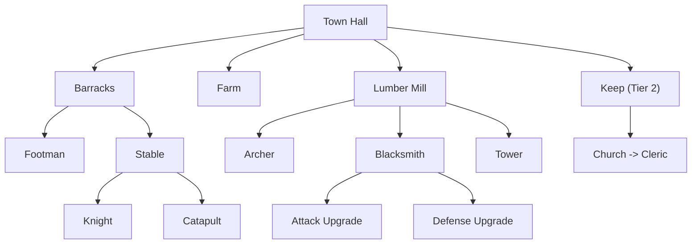

# Warcraft Web

A Warcraft 2 inspired real-time strategy game built for the browser. Features isometric 2D graphics, two asymmetrically-named factions (Humans and Orcs), resource gathering, base building, unit production, combat, fog of war, and a CPU AI opponent — all running on a deterministic shared simulation powered by a custom Entity Component System.

## Disclaimer

Before you proceed and ask yourself - "Is this...?"

Yes — this project is largely LLM-generated.

I’ve been a professional software engineer for over 20 years, and building systems has always been my real passion. Clean code matters, but mostly as a byproduct of good design.

Like many engineers, I’ve accumulated a long list of unfinished side projects. Not because the ideas weren’t compelling, but because time and energy are finite. After a full day of intense work, sitting down to write more code — even for something fun — is harder than it sounds. LLMs have fundamentally changed that constraint.

This isn’t the future I imagined or asked for. The shift has been disruptive, uncomfortable, and at times unsettling. I was skeptical. Then anxious. Then resistant. But ignoring this new reality is no longer possible.

What LLMs offer isn’t magic — they offer leverage. They compress time. They lower activation energy. They allow ideas that once required months of spare time to become viable experiments.

A couple days into this project, I was surprised by how much it already did. And yet, it didn’t feel the same as building something entirely by hand. That tension is real, but very little in this industry is truly built alone. We stand on frameworks, compilers, open-source ecosystems, and decades of collective work. LLMs are another layer in that stack.

This repository is both a project and an exploration of that reality.


## Summary

Warcraft Web is a full-stack TypeScript RTS game organized as a monorepo with four packages:

- **`@warcraft-web/shared`** — The deterministic game engine: ECS framework, all game systems (movement, combat, resource gathering, production, construction, pathfinding, fog of war), game data tables, AI opponent, and fixed-point math utilities.
- **`@warcraft-web/client`** — The browser frontend: PixiJS-based isometric renderer, input handling, HUD, menus, minimap, particle effects, and debug tools.
- **`@warcraft-web/server`** — The multiplayer backend: Express + WebSocket server implementing lockstep synchronization with desync detection.
- **`@warcraft-web/cli`** — Developer CLI for building, testing, and scaffolding.

### Tech Stack

| Layer | Technology |
|---|---|
| Language | TypeScript (ES2022, strict mode) |
| Monorepo | npm workspaces |
| Build / Dev | Vite 6 (client), tsc (shared/server/cli) |
| Runtime | Node.js >= 20 (server/cli), Browser (client) |
| Rendering | PixiJS 8 (WebGL/WebGPU) |
| Networking | WebSocket (ws) + Express |
| Game Engine | Custom ECS with fixed-point arithmetic |
| AI | Advisor/task architecture with personality presets |
| Debug | Tweakpane |

### Getting Started

```bash
# Install dependencies
npm install

# Start the client dev server
npm run dev

# Start the multiplayer server
npm run dev:server

# Run the developer CLI
npm run cli
```

## Screenshots

| Main Menu | Faction Selection |
|:---------:|:-----------------:|
|  |  |

| Gameplay with Fog of War | Battle |
|:------------------------:|:------:|
|  |  |

| Gameplay with Debug Panel |
|:-------------------------:|
|  |

### Project Structure

```
warcraft-web/
├── packages/
│   ├── shared/          # Deterministic game engine (ECS, systems, AI, data)
│   ├── client/          # Browser client (PixiJS renderer, input, UI)
│   ├── server/          # Multiplayer server (WebSocket lockstep)
│   └── cli/             # Developer CLI
├── docs/                # Design documents
│   ├── game-design.md
│   ├── ai-system-design.md
│   ├── visual-effects-design.md
│   └── implementation-plan.md
└── package.json
```

---

## Game Design Document

### High-Level Architecture



### Networking Model: Command-Based Lockstep

The game uses a **command-based lockstep** model where clients send commands (not state) to the server, and all participants run an identical deterministic simulation.



1. Clients send **commands** to the server: "move unit 5 to tile (12,8)"
2. Server **validates** commands (ownership, legality)
3. Server **applies** commands to its authoritative simulation and **broadcasts** them with a tick number
4. Clients **run the same simulation** using shared code, applying commands at the correct tick
5. Server periodically sends **state checksums** for desync detection
6. On desync, server sends a **full state snapshot** to resync

**Tick rate:** 10 ticks/second (100ms). The renderer interpolates between ticks at the browser's frame rate for smooth visuals.

### Entity Component System

The ECS is the heart of the simulation. It is fully **deterministic** — given the same inputs, it produces identical outputs on every client and the server, ensured through fixed-point arithmetic.

**System execution order (per tick):**

1. **ProductionSystem** — train units, advance queues
2. **ResourceGatheringSystem** — worker gather/deposit cycle
3. **BuildingConstructionSystem** — advance construction progress
4. **RepairSystem** — repair damaged buildings
5. **PatrolSystem** — advance patrol waypoints
6. **MovementSystem** — move units along paths (A* pathfinding)
7. **CollisionSystem** — resolve unit collisions
8. **CombatSystem** — resolve attacks, apply damage
9. **DeathCleanupSystem** — remove dead entities
10. **AISystem** — drive AI controllers

### Factions

Two factions with symmetric gameplay but distinct unit/building names:

**Humans (The Kingdom)**

| Unit | Role |
|------|------|
| Worker | Resource gathering, construction |
| Footman | Melee infantry |
| Archer | Ranged |
| Knight | Heavy mounted melee |
| Ballista | Siege (high building damage) |
| Cleric | Healer/support |

**Orcs (The Horde)**

| Unit | Role |
|------|------|
| Peon | Resource gathering, construction |
| Grunt | Melee infantry |
| Troll Axethrower | Ranged |
| Raider | Mounted melee |
| Catapult | Siege |
| Shaman | Offensive caster |

### Resources

- **Gold** — mined from gold mines (limited supply per mine, depleted over time)
- **Lumber** — harvested from trees (trees are destroyed when depleted)

Workers carry resources back to the nearest Town Hall / Great Hall for deposit.

### Buildings

| Human | Orc | Function |
|-------|-----|----------|
| Town Hall | Great Hall | Main building, worker production, resource drop-off |
| Farm | Pig Farm | Increases supply cap |
| Barracks | Barracks | Infantry production |
| Lumber Mill | War Mill | Ranged unit production, upgrades |
| Blacksmith | Blacksmith | Combat upgrades |
| Stable | Beastiary | Mounted units, siege |
| Tower | Guard Tower | Static defense |

### Tech Tree



### Isometric Rendering

The game uses an isometric projection with the following coordinate pipeline:

**World Space** (tile x, y) → **Isometric Screen Space** → **Pixel Screen Space** (with camera offset + zoom)

Rendering layers (back to front):

1. Terrain tiles
2. Resource nodes (trees, gold mines)
3. Buildings (Y-sorted)
4. Units (Y-sorted)
5. Effects / particles
6. Fog of war overlay
7. Selection indicators, health bars
8. UI overlay

### Fog of War

Each player has a per-tile visibility grid:

- **Unexplored** (black) — never seen
- **Explored** (dark, terrain only) — previously seen but no current vision
- **Visible** (fully lit) — within sight range of a friendly unit or building

Updated every simulation tick by the FogOfWarSystem.

### Pathfinding

- **A\*** on the tile grid for unit movement
- Navigation grid updated when buildings are placed or destroyed
- Collision avoidance via steering behaviors

### AI Opponent

The CPU AI uses an **advisor/task architecture** with configurable personality presets:

- **Advisors** (Economy, Military, Defense, Expansion, Scout) analyze the world state and propose actions
- **Personality presets** (Rusher, Turtler, Balanced, Boomer) weight proposals differently
- **Tasks** (Attack, Build, Defend, Gather, Patrol, Scout, Train) execute chosen proposals over multiple ticks
- **Three-layer reactivity**: reflexes (every tick), tactical (every 5 ticks), strategic (every N ticks)

See [docs/ai-system-design.md](docs/ai-system-design.md) for the full AI design.

### Maps

Maps are procedurally generated with symmetry for fair 2-player matches. The generator places terrain, resources (gold mines, forests), and starting positions.

---

## Design Documents

Detailed design documents are available in the [`docs/`](docs/) directory:

- [**Game Design**](docs/game-design.md) — Full architecture design, technology rationale, and system deep dives
- [**AI System Design**](docs/ai-system-design.md) — CPU opponent architecture, advisors, tasks, and personality system
- [**Visual Effects Design**](docs/visual-effects-design.md) — Particle system, effect catalog, and rendering integration
- [**Implementation Plan**](docs/implementation-plan.md) — Gameplay specification, gap analysis, and evolution roadmap

## License

[MIT](LICENSE)
