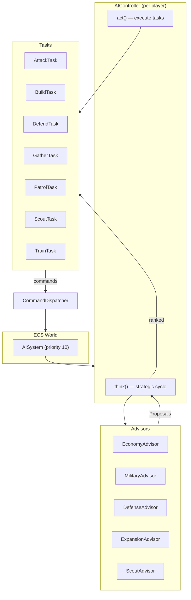

# CPU AI System Design

## Overview

The AI system uses a **Utility AI with Goal Decomposition** pattern. Five specialized advisors analyze the game state through a world-view snapshot and propose actions. Proposals are scored against a configurable personality profile, and the winning proposals are executed as multi-tick tasks.

### Design Principles

- Every module independently testable
- No cross-boundary access — advisors read a snapshot, tasks write through a command dispatcher
- Composable Advisor interface (pure function: WorldView + Personality → Proposals)
- Full determinism via seeded RNG

---

## Architecture



---

## Core Abstractions

### AIPersonality

Configurable weight vector that biases the AI's strategic decisions.

```typescript
interface AIPersonality {
  economy: number;    // 0–1, weight for economic proposals
  military: number;   // 0–1, weight for military proposals
  expansion: number;  // 0–1, weight for expansion proposals
  defense: number;    // 0–1, weight for defensive proposals
  scout: number;      // 0–1, weight for scouting proposals
}
```

**Presets:**

| Preset | Economy | Military | Expansion | Defense | Scout |
|--------|---------|----------|-----------|---------|-------|
| Rusher | 0.5 | 1.0 | 0.2 | 0.3 | 0.4 |
| Turtler | 0.7 | 0.4 | 0.3 | 1.0 | 0.5 |
| Balanced | 0.7 | 0.7 | 0.5 | 0.5 | 0.5 |
| Boomer | 1.0 | 0.3 | 0.8 | 0.4 | 0.6 |

A random preset is selected at the start of each game.

### Advisor Interface

```typescript
interface Advisor {
  evaluate(view: AIWorldView, personality: AIPersonality): Proposal[];
}

interface Proposal {
  type: string;
  priority: number;      // Base priority from advisor
  category: string;      // Maps to personality weight
  params: Record<string, unknown>;
}
```

Advisors are **pure functions** — they read the world view snapshot and personality, and return scored proposals. They never mutate game state.

### Task Interface

```typescript
interface Task {
  readonly type: string;
  start(ctx: TaskContext): void;
  update(ctx: TaskContext): TaskStatus;
  abort(ctx: TaskContext): void;
}

type TaskStatus = 'running' | 'completed' | 'failed';
```

Tasks are **multi-tick executors** — they carry state across ticks and issue commands through the CommandDispatcher.

### AIWorldView

A read-only snapshot of the game state from the AI's perspective:

- Own units (by type), buildings (by kind), idle workers
- Known enemy units and buildings
- Resource state (gold, lumber, supply used/max)
- Threat assessment (nearby enemies per building)
- Military strength comparison (own vs enemy)
- Map exploration coverage

### CommandDispatcher

Thin wrapper that translates AI decisions into ECS world mutations:

- `moveUnit(entityId, target)`
- `attackTarget(entityId, targetId)`
- `buildStructure(builderId, buildingKind, position)`
- `queueUnit(buildingId, unitKind)`
- `patrol(entityId, waypoints)`

---

## The Five Advisors

### EconomyAdvisor

Manages the resource pipeline: worker production, resource assignment, and supply buildings.

**Key logic:**
- Propose training workers when below target count (scales with game phase)
- Propose building farms when supply headroom is low
- Propose reassigning idle workers to nearest resources
- Higher priority when gold/lumber income is below thresholds

### MilitaryAdvisor

Manages army composition and offensive operations.

**Key logic:**
- Propose training military units based on army composition targets
- Propose attack when army strength exceeds enemy strength by a threshold
- Escalate attack priority over time (prevent passive stalemates)
- Prefer unit types that counter observed enemy composition

### DefenseAdvisor

Protects the base from threats.

**Key logic:**
- Propose building towers near vulnerable base positions
- Propose rallying military units to defend when threats detected
- Higher priority when enemy units are near own buildings
- Scale response proportionally to threat size

### ExpansionAdvisor

Manages base growth and tech progression.

**Key logic:**
- Propose building production buildings (barracks, stables, etc.) based on tech tree
- Propose upgrading Town Hall when prerequisites met
- Propose building additional resource drop-off points
- Gate proposals behind resource thresholds

### ScoutAdvisor

Manages map awareness and enemy tracking.

**Key logic:**
- Propose scouting unexplored areas of the map
- Propose patrolling known enemy approach routes
- Higher priority early game when map knowledge is low
- Use idle military units for scouting when no dedicated scouts

---

## Three-Layer Reactivity Model

The AI operates on three time scales:

### Layer 1 — Reflexes (every tick)

Immediate threat response:
- Detect units under attack → flee or fight back
- Health delta scanning → emergency retreat for low-HP units

### Layer 2 — Tactical (every 5 ticks)

Short-term adjustments:
- Reassign idle workers to resources
- Clean up failed/completed tasks
- Rebalance worker assignments (gold vs lumber)

### Layer 3 — Strategic (every N ticks, configurable)

Full advisor evaluation cycle:
- Build AIWorldView snapshot
- Run all five advisors
- Score proposals: `finalScore = proposal.priority × personality[proposal.category]`
- Rank proposals, create tasks for top N
- Prune conflicting or redundant tasks

---

## Decision Flow Example

One complete think cycle:

1. **Snapshot**: AIWorldView built — 4 workers, 2 footmen, 1 barracks, gold: 300, lumber: 200, supply: 6/10
2. **EconomyAdvisor**: "Train worker" (priority 0.8), "Build farm" (priority 0.3)
3. **MilitaryAdvisor**: "Train footman" (priority 0.7), "Attack enemy" (priority 0.2)
4. **DefenseAdvisor**: "Build tower" (priority 0.4)
5. **ExpansionAdvisor**: "Build lumber mill" (priority 0.6)
6. **ScoutAdvisor**: "Scout north" (priority 0.5)
7. **Scoring** (Balanced personality): Train worker: 0.56, Train footman: 0.49, Build lumber mill: 0.30, Scout north: 0.25, Build tower: 0.20, Build farm: 0.21, Attack: 0.14
8. **Result**: Create TrainTask(worker) and TrainTask(footman), queue BuildTask(lumber_mill)

---

## Design Considerations

### Fog of War

v1: AI is **omniscient** (sees the full map). Future versions will respect fog of war for fairness, with the ScoutAdvisor becoming critical for intelligence gathering.

### Difficulty Scaling

Personality weights and think interval can be tuned:
- Easy: longer think interval, suboptimal weights, intentional delays
- Hard: shorter think interval, optimized weights, faster reactions

### Debugging

`AIDebugState` captures a snapshot of the AI's current state — active tasks, last proposals, personality weights — for display in the Tweakpane debug panel.

### Determinism

The AI uses a **seeded RNG** (`AIRandom`) for any random decisions (personality selection, tie-breaking). This ensures identical behavior given the same seed, which is critical for lockstep multiplayer.

### Multiple AI Players

The `AISystem` iterates over all AI-controlled players, each with their own `AIController` instance and personality. Multiple AIs can play in the same game.
