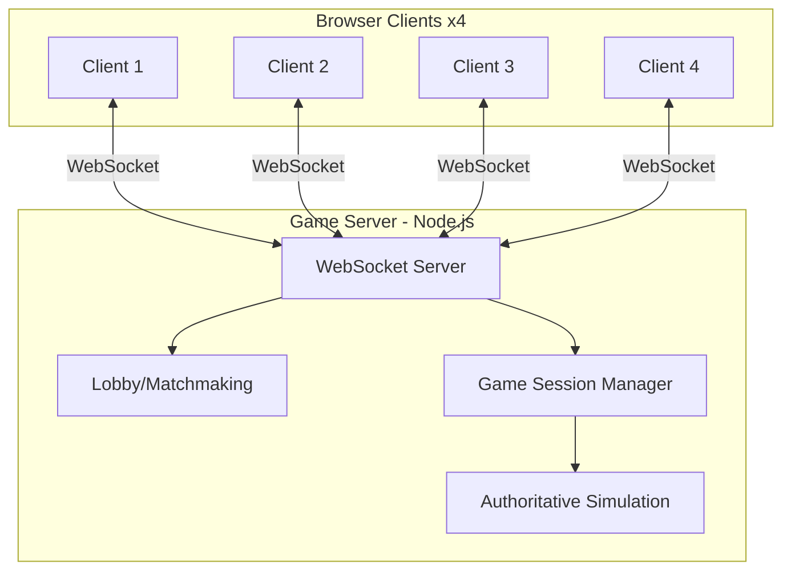
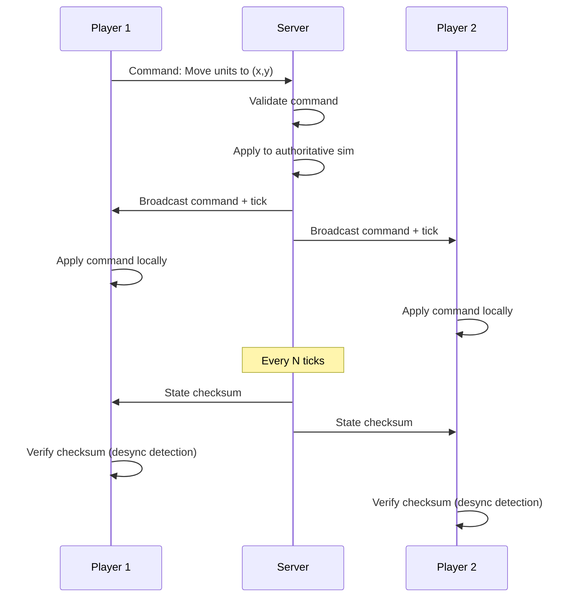
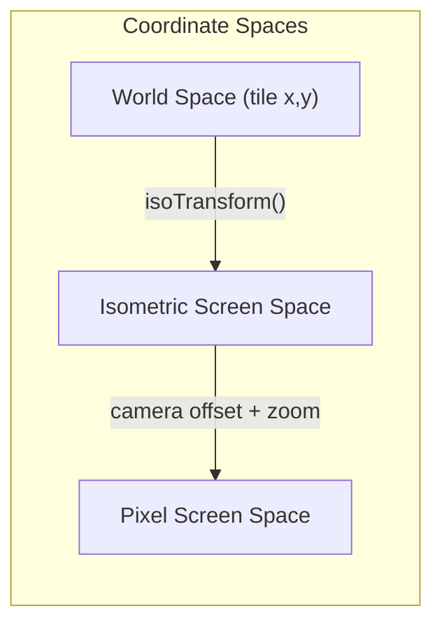
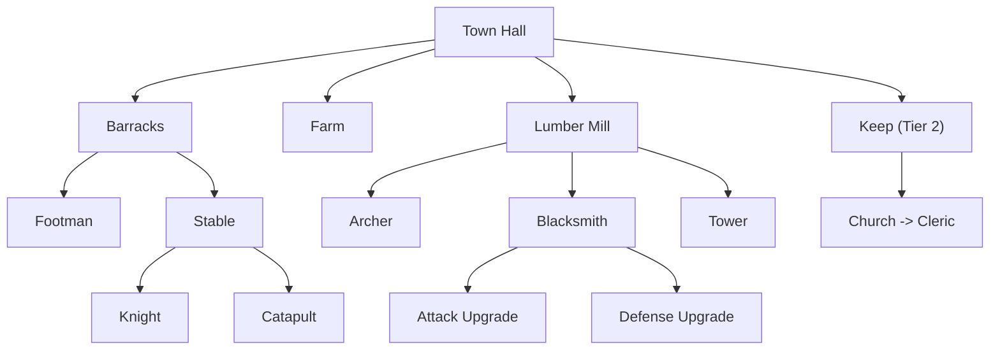

# RTS Game — Full Stack Architecture Design

## High-Level Architecture



## Technology Stack

| Layer | Technology | Rationale |
|-------|-----------|-----------|
| **Frontend** | TypeScript | Type safety, shared code with server |
| | PixiJS v8 | High-performance WebGL 2D renderer, ideal for isometric sprite rendering |
| | Vite | Fast HMR, excellent TS support, handles asset pipeline |
| **Backend** | TypeScript / Node.js | Shared simulation code with client |
| | ws (WebSocket) | Lightweight, no unnecessary abstraction over raw WebSocket |
| | Express | Minimal HTTP server for lobby API, static assets, health checks |
| **Shared** | Custom ECS | Deterministic game simulation |
| | Shared game config | Unit stats, building data, tech trees |
| | Fixed-point math | Deterministic cross-client computation |
| **Tooling** | npm workspaces | Monorepo management |
| | Vitest | Unit/integration testing (simulation determinism tests) |
| | ESLint + Prettier | Code quality |

---

## Networking Model: Command-Based Server-Authoritative

This is the critical architectural decision. We use a **server-authoritative model with client-side prediction**, which balances bandwidth efficiency, cheat prevention, and smooth gameplay.



**How it works:**

1. Clients send **commands** (not state) to the server: "move unit 5 to tile (12,8)"
2. Server **validates** commands (is it this player's unit? is the move legal?)
3. Server **applies** commands to its authoritative simulation and **broadcasts** them to all clients with a tick number
4. Clients **run the same simulation locally** using shared code, applying commands at the correct tick
5. Server periodically sends **state checksums** for desync detection
6. On desync, server sends a **full state snapshot** to resync the client

**Why this model:**

- **Bandwidth efficient** — only commands travel the wire (not hundreds of unit positions)
- **Cheat-resistant** — server validates all commands
- **Smooth** — clients predict locally, no waiting for server response
- **Shared code** — identical simulation runs on client and server (TypeScript monorepo)

---

## Monorepo Structure

```
warcraft-web/
├── packages/
│   ├── shared/                 # Shared simulation & game logic
│   │   ├── src/
│   │   │   ├── ecs/            # Entity Component System
│   │   │   │   ├── World.ts
│   │   │   │   ├── Entity.ts
│   │   │   │   ├── Component.ts
│   │   │   │   └── System.ts
│   │   │   ├── systems/        # Game systems (deterministic)
│   │   │   │   ├── MovementSystem.ts
│   │   │   │   ├── CombatSystem.ts
│   │   │   │   ├── ResourceGatheringSystem.ts
│   │   │   │   ├── ProductionSystem.ts
│   │   │   │   ├── BuildingConstructionSystem.ts
│   │   │   │   ├── RepairSystem.ts
│   │   │   │   ├── PatrolSystem.ts
│   │   │   │   ├── CollisionSystem.ts
│   │   │   │   └── DeathCleanupSystem.ts
│   │   │   ├── components/     # Component definitions
│   │   │   │   ├── Position.ts
│   │   │   │   ├── Health.ts
│   │   │   │   ├── Combat.ts
│   │   │   │   ├── Movement.ts
│   │   │   │   ├── Owner.ts
│   │   │   │   ├── ResourceCarrier.ts
│   │   │   │   ├── ResourceSource.ts
│   │   │   │   ├── Building.ts
│   │   │   │   ├── Production.ts
│   │   │   │   ├── UnitType.ts
│   │   │   │   ├── UnitBehavior.ts
│   │   │   │   ├── Collider.ts
│   │   │   │   └── Selectable.ts
│   │   │   ├── ai/             # CPU AI opponent
│   │   │   │   ├── AISystem.ts
│   │   │   │   ├── AIController.ts
│   │   │   │   ├── AIPersonality.ts
│   │   │   │   ├── AIWorldView.ts
│   │   │   │   ├── AIGameInterface.ts
│   │   │   │   ├── CommandDispatcher.ts
│   │   │   │   ├── advisors/
│   │   │   │   └── tasks/
│   │   │   ├── data/           # Static game data tables
│   │   │   │   ├── UnitData.ts
│   │   │   │   └── BuildingData.ts
│   │   │   ├── game/           # Game-level logic
│   │   │   │   ├── FogOfWar.ts
│   │   │   │   ├── GameEventLog.ts
│   │   │   │   ├── Orders.ts
│   │   │   │   └── PlayerResources.ts
│   │   │   ├── map/            # Map and terrain
│   │   │   │   ├── GameMap.ts
│   │   │   │   ├── MapGenerator.ts
│   │   │   │   ├── Pathfinding.ts
│   │   │   │   └── Terrain.ts
│   │   │   ├── math/           # Deterministic math
│   │   │   │   ├── FixedPoint.ts
│   │   │   │   ├── IsoMath.ts
│   │   │   │   └── Point.ts
│   │   │   └── protocol/       # Client-server protocol
│   │   │       └── Protocol.ts
│   │   └── package.json
│   │
│   ├── client/                 # Browser client
│   │   ├── src/
│   │   │   ├── main.ts
│   │   │   ├── renderer/       # PixiJS rendering
│   │   │   ├── input/          # Mouse/keyboard handling
│   │   │   ├── ui/             # HUD and menus
│   │   │   ├── effects/        # Particle effects
│   │   │   ├── game/           # Client game session
│   │   │   ├── assets/         # Asset loading
│   │   │   └── debug/          # Debug overlay
│   │   ├── public/assets/      # Sprite assets
│   │   ├── index.html
│   │   └── vite.config.ts
│   │
│   ├── server/                 # Multiplayer server
│   │   ├── src/
│   │   │   ├── main.ts
│   │   │   ├── Lobby.ts
│   │   │   └── GameSession.ts
│   │   └── package.json
│   │
│   └── cli/                    # Developer CLI
│       └── src/
│           ├── index.ts
│           └── commands/
│
├── docs/                       # Design documents
├── package.json
└── tsconfig.base.json
```

---

## Core Systems Deep Dive

### 1. Entity Component System (ECS)

The ECS is the heart of the game simulation. It must be **deterministic** — given the same inputs, it produces the same outputs on every client and the server.

```typescript
class World {
  private entities: Map<EntityId, Set<ComponentType>>;
  private components: Map<ComponentType, Map<EntityId, Component>>;
  private systems: System[];

  tick(deltaMs: number, commands: Command[]): void {
    // Process commands first (deterministic order)
    for (const cmd of commands) {
      this.commandProcessor.execute(cmd);
    }
    // Run all systems in fixed order
    for (const system of this.systems) {
      system.update(this, deltaMs);
    }
  }

  checksum(): number {
    // Deterministic hash of all entity/component state
  }
}
```

**System execution order (per tick):**

1. **CommandProcessor** — apply player commands
2. **ProductionSystem** — train units, research upgrades
3. **ResourceGatheringSystem** — gather/deposit resources
4. **BuildingConstructionSystem** — advance construction
5. **RepairSystem** — repair damaged buildings
6. **PatrolSystem** — advance patrol waypoints
7. **MovementSystem** — move units along paths (includes A* pathfinding)
8. **CollisionSystem** — resolve unit collisions
9. **CombatSystem** — resolve attacks, apply damage
10. **DeathCleanupSystem** — remove dead entities, trigger events
11. **AISystem** — drive AI controllers

### 2. Isometric Rendering



**Isometric coordinate conversion:**

```typescript
function tileToScreen(tileX: number, tileY: number): { x: number, y: number } {
  return {
    x: (tileX - tileY) * TILE_WIDTH_HALF,
    y: (tileX + tileY) * TILE_HEIGHT_HALF
  };
}
```

**Rendering layers (back to front):**

1. Terrain tiles (ground)
2. Resource nodes (trees, gold mines)
3. Buildings (sorted by Y)
4. Units (sorted by Y for correct overlap)
5. Effects / particles
6. Fog of war overlay
7. Selection indicators, health bars
8. UI overlay (HTML/CSS on top of canvas)

### 3. Networking Protocol

**Message types:**

```typescript
// Client -> Server
type ClientMessage =
  | { type: 'join_lobby'; playerName: string }
  | { type: 'create_room'; mapId: string }
  | { type: 'ready' }
  | { type: 'command'; tick: number; command: GameCommand }
  | { type: 'chat'; message: string }
  | { type: 'checksum'; tick: number; hash: number };

// Server -> Client
type ServerMessage =
  | { type: 'lobby_state'; rooms: RoomInfo[] }
  | { type: 'game_start'; config: GameConfig; playerSlot: number }
  | { type: 'commands'; tick: number; commands: GameCommand[] }
  | { type: 'checksum_request'; tick: number }
  | { type: 'full_state'; tick: number; state: SerializedWorld }
  | { type: 'player_disconnected'; playerId: number };
```

**Tick rate:** 10 simulation ticks/second (100ms per tick). The renderer interpolates between ticks at 60fps for smooth visuals.

### 4. Fog of War

Each player has a **visibility grid** matching the tile map:

- **Unexplored** (black) — never seen
- **Explored** (dark, shows terrain only) — previously seen but no current vision
- **Visible** (fully lit) — currently in sight range of a friendly unit/building

Updated every simulation tick by the FogOfWarSystem. On the client, rendered as a semi-transparent overlay using a secondary PixiJS render texture.

### 5. Pathfinding

- **A\*** on the tile grid for individual unit movement
- Navigation grid updated when buildings are placed/destroyed
- Collision avoidance via steering behaviors (units don't overlap)

---

## Game Content

### Factions

**Faction A: "The Kingdom" (Humans)**

- Worker — gathers resources, builds
- Footman — melee infantry
- Archer — ranged
- Knight — heavy mounted melee
- Ballista — siege, high building damage
- Cleric — healer/support

**Faction B: "The Horde" (Orcs)**

- Peon — gathers resources, builds
- Grunt — melee infantry
- Troll Axethrower — ranged
- Raider — mounted melee
- Catapult — siege
- Shaman — offensive caster

### Resources

- **Gold** — mined from gold mines (limited per mine)
- **Lumber** — harvested from trees (trees are destroyed when depleted)

### Buildings (per faction)

- Town Hall / Great Hall — main building, worker production, resource drop-off
- Barracks — infantry production
- Lumber Mill / War Mill — ranged unit production, upgrades
- Stable / Beastiary — mounted units
- Farm / Pig Farm — increases supply cap
- Tower / Guard Tower — static defense
- Blacksmith — combat upgrades (attack/defense)

### Tech Tree



---

## Art Assets Strategy

Use AI-generated pixel art sprites with a consistent Warcraft 2 aesthetic. All sprites use a **magenta chroma key** background for transparency.

Key assets:

- Isometric terrain tileset (grass, dirt, water, forest, stone, sand)
- Unit sprites (per-faction, per-unit-type)
- Building sprites (per-faction, under construction + complete states)
- Resource sprites (gold mine, tree variants)
- UI elements (minimap, HUD panels)

Visual style: muted earth-tone palette, chunky pixel art, medieval-fantasy UI frame.

---

## Key Technical Risks and Mitigations

1. **Simulation determinism** — JavaScript floating point can vary across environments. Mitigation: use integer/fixed-point math for all gameplay calculations. Test with automated desync detection.

2. **Performance with many units** — Hundreds of sprites + pathfinding can be expensive. Mitigation: spatial hashing for collision/queries, object pooling for sprites, frustum culling.

3. **Network latency** — RTS commands feel sluggish with high latency. Mitigation: client-side prediction (apply commands locally immediately), server confirms or corrects. The 100ms tick rate provides a natural command buffer.

4. **Asset consistency** — AI-generated sprites need a unified look. Mitigation: consistent prompting, magenta chroma key pipeline, post-processing to unify palette.
