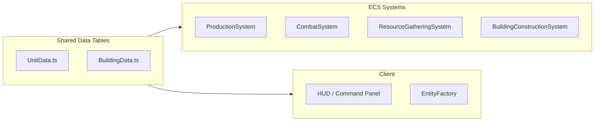

# Implementation Plan & Gameplay Specification

## Target Gameplay Summary

A **Warcraft 2 inspired** land-only RTS with two mirrored factions (Humans and Orcs). Fully **data-driven** design — unit stats, building costs, and tech prerequisites are defined in shared data tables, making balance tuning straightforward.

The game supports both **single-player** (vs CPU AI) and **multiplayer** (2-player lockstep via WebSocket). Maps are procedurally generated with symmetry for fair play.

---

## Unit Roster

### Humans

| Unit | Cost (G/L) | Supply | HP | Attack | Range | Speed | Training Building | Orders |
|------|-----------|--------|-----|--------|-------|-------|-------------------|--------|
| Worker | 400/0 | 1 | 30 | 3 | 1 | 0.8 | Town Hall | Move, Gather, Build, Repair |
| Footman | 600/0 | 1 | 60 | 6 | 1 | 0.9 | Barracks | Move, Attack, Patrol |
| Archer | 500/50 | 1 | 40 | 4 | 5 | 0.9 | Lumber Mill | Move, Attack, Patrol |
| Knight | 800/100 | 2 | 90 | 8 | 1 | 1.2 | Stable | Move, Attack, Patrol |
| Ballista | 900/300 | 3 | 80 | 25 | 7 | 0.5 | Stable | Move, Attack |
| Cleric | 700/100 | 1 | 25 | 0 | 5 | 0.8 | Church | Move, Heal |

### Orcs

| Unit | Cost (G/L) | Supply | HP | Attack | Range | Speed | Training Building | Orders |
|------|-----------|--------|-----|--------|-------|-------|-------------------|--------|
| Peon | 400/0 | 1 | 30 | 3 | 1 | 0.8 | Great Hall | Move, Gather, Build, Repair |
| Grunt | 600/0 | 1 | 60 | 6 | 1 | 0.9 | Barracks | Move, Attack, Patrol |
| Troll Axethrower | 500/50 | 1 | 40 | 4 | 5 | 0.9 | War Mill | Move, Attack, Patrol |
| Raider | 800/100 | 2 | 90 | 8 | 1 | 1.2 | Beastiary | Move, Attack, Patrol |
| Catapult | 900/300 | 3 | 80 | 25 | 7 | 0.5 | Beastiary | Move, Attack |
| Shaman | 700/100 | 1 | 25 | 5 | 4 | 0.8 | Temple | Move, Attack |

---

## Building Roster

### Humans

| Building | Cost (G/L) | HP | Supply | Prerequisite | Produces |
|----------|-----------|-----|--------|--------------|----------|
| Town Hall | 1200/800 | 600 | 1 | — | Worker |
| Farm | 500/250 | 100 | +4 | Town Hall | — |
| Barracks | 700/450 | 300 | — | Town Hall | Footman |
| Lumber Mill | 600/450 | 300 | — | Town Hall | Archer |
| Blacksmith | 800/450 | 300 | — | Lumber Mill | — (upgrades) |
| Stable | 1000/300 | 300 | — | Barracks | Knight, Ballista |
| Tower | 550/200 | 200 | — | Lumber Mill | — (static defense) |

### Orcs

| Building | Cost (G/L) | HP | Supply | Prerequisite | Produces |
|----------|-----------|-----|--------|--------------|----------|
| Great Hall | 1200/800 | 600 | 1 | — | Peon |
| Pig Farm | 500/250 | 100 | +4 | Great Hall | — |
| Barracks | 700/450 | 300 | — | Great Hall | Grunt |
| War Mill | 600/450 | 300 | — | Great Hall | Troll Axethrower |
| Blacksmith | 800/450 | 300 | — | War Mill | — (upgrades) |
| Beastiary | 1000/300 | 300 | — | Barracks | Raider, Catapult |
| Guard Tower | 550/200 | 200 | — | War Mill | — (static defense) |

---

## Resource System

### Gold
- Mined from gold mines by workers
- Each gold mine has a limited supply (typically 10,000)
- Workers carry 100 gold per trip
- Workers must return to Town Hall / Great Hall to deposit

### Lumber
- Harvested from trees by workers
- Each tree tile has limited lumber (destroyed when depleted)
- Workers carry 100 lumber per trip
- Workers must return to Town Hall / Great Hall to deposit

### Supply
- Each unit costs supply (1-3 depending on unit type)
- Farms / Pig Farms provide +4 supply each
- Town Hall / Great Hall provides 1 supply
- Maximum supply cap: not yet defined
- Cannot train units when at supply cap

---

## What Works (Current State)

- 13 ECS components covering position, health, combat, movement, ownership, resources, buildings, production, behavior
- 9 deterministic game systems: Movement, Patrol, Collision, Combat, ResourceGathering, Production, BuildingConstruction, Repair, DeathCleanup
- A* pathfinding on tile grid
- Full combat system with range, damage, cooldowns
- Worker gather/deposit cycle
- Building construction with worker assignment
- Unit production queues
- Fog of war (tile-based visibility)
- Procedural map generation with symmetry
- PixiJS isometric renderer with camera controls
- Selection box, unit commands, HUD
- Minimap
- Single-player game with AI opponent
- Multiplayer lobby and lockstep game session
- Particle effects system
- Asset loading with progress screen
- Main menu → Faction select → Game flow
- Debug overlay (Tweakpane)

---

## Known Gaps

- Resource cost deduction not fully enforced for all actions
- Supply cap enforcement incomplete
- Building placement validation (collision with existing buildings/units)
- Faction-aware production menus in HUD
- Tech tree prerequisites not enforced in production system
- Tower attacks (static defense)
- Win condition detection (all buildings destroyed)
- Audio system (sound effects, music)
- Multiplayer client integration (NetworkGame connecting to server)
- Upgrades (attack/defense from Blacksmith)
- Unit grouping and group movement
- Rally points for production buildings

---

## Evolution Roadmap

### Phase 1 — Core Economy Fixes
- Enforce resource cost deduction on all build/train actions
- Enforce supply cap checks before training
- Add "insufficient resources" / "supply blocked" feedback to HUD

### Phase 2 — Building & Production Polish
- Building placement validation (no overlap with existing entities)
- Faction-aware command panel (show correct buildings/units per faction)
- Tech tree prerequisite enforcement
- Rally points for production buildings

### Phase 3 — Defense & Combat
- Tower auto-attack system (buildings with Combat component)
- Attack-move command (move + auto-engage enemies in range)
- Unit grouping (Ctrl+number) and group movement
- Combat upgrades from Blacksmith

### Phase 4 — Win Conditions & Game Flow
- Victory/defeat detection (all enemy buildings destroyed, or surrender)
- End-game screen with stats
- Rematch option

### Phase 5 — Multiplayer Polish
- Connect NetworkGame client to server
- In-game chat
- Reconnection handling
- Spectator mode (future)

### Phase 6 — Audio & Polish
- Sound effects (unit acknowledgments, combat sounds, building placement)
- Background music
- More particle effects (ambient, phase 3 effects catalog)
- UI polish (tooltips, hotkeys display, better HUD layout)

---

## Data-Driven Architecture

All unit stats, building costs, and prerequisites are defined in `UnitData.ts` and `BuildingData.ts`. Systems and the client read from these tables, so balance changes require no code modifications — only data table updates.
