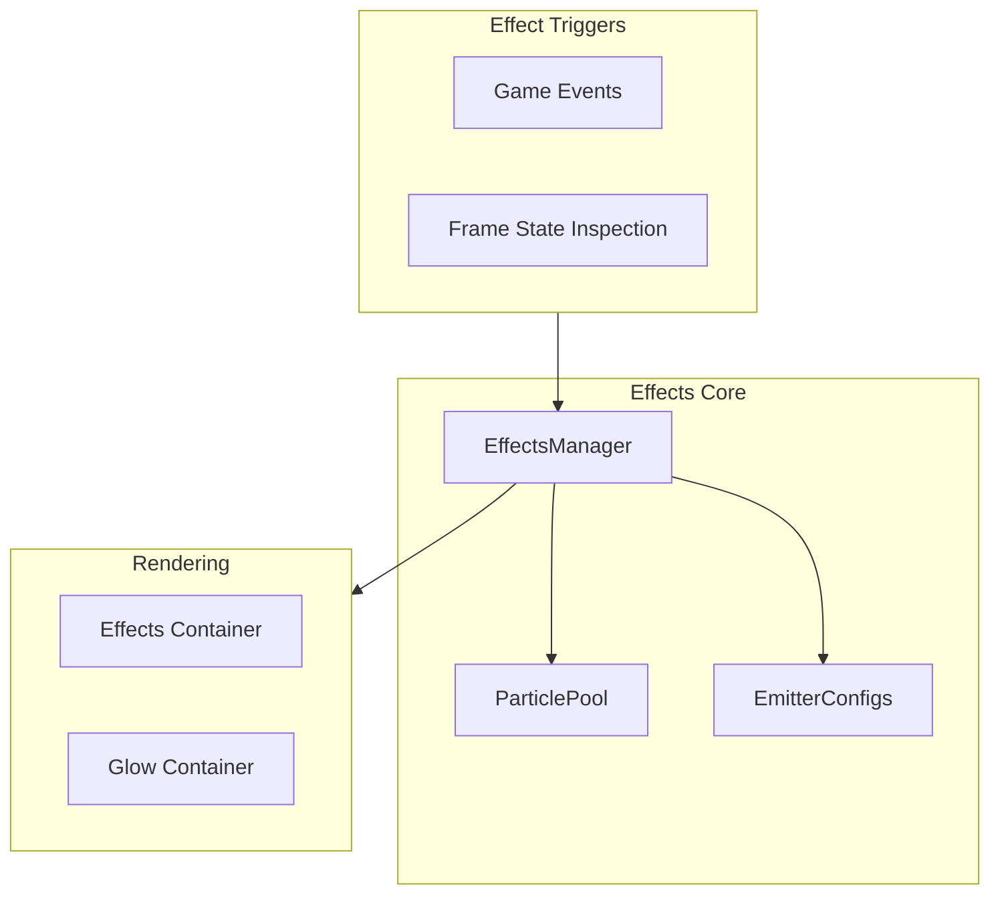

# Visual Effects System Design

## Overview

A custom particle effects system built for tight ECS integration, pixel-art aesthetics, and zero external dependencies. The system prioritizes a retro feel with small, crisp particles that complement the chunky sprite art style.

---

## Architecture



---

## Core Classes

### Particle

```typescript
interface Particle {
  sprite: Sprite;
  x: number; y: number;
  vx: number; vy: number;
  life: number;
  maxLife: number;
  alpha: number;
  scale: number;
  rotation: number;
  color: number;
}
```

### ParticlePool

Pre-allocates a fixed number of sprites (512 by default) and recycles them. Avoids GC pressure during gameplay. When the pool is exhausted, oldest particles are recycled first.

### EmitterConfig

Defines the behavior of a particle emitter:

```typescript
interface EmitterConfig {
  count: number;          // Particles per burst
  lifetime: [min, max];   // Seconds
  speed: [min, max];      // Pixels/second
  angle: [min, max];      // Emission angle range
  gravity: number;        // Downward acceleration
  scale: [start, end];    // Scale over lifetime
  alpha: [start, end];    // Alpha over lifetime
  color: number | number[]; // Fixed or random from set
  texture: string;        // Procedural texture key
}
```

### EffectsManager

Central orchestrator that:
- Listens for game events and per-frame state changes
- Spawns particle bursts using emitter configs
- Updates all active particles each frame
- Returns expired particles to the pool
- Manages the effects and glow rendering containers

---

## Rendering Integration

Container order in the world container (back to front):

1. Terrain
2. Entities (units + buildings)
3. **Effects container**
4. **Glow container**
5. Fog of war
6. Ghost building (placement preview)

Effects render above entities but below fog, so explosions and sparks appear in the game world naturally.

---

## Effect Triggers

### Game Events

| Event | Effect |
|-------|--------|
| `unit_under_attack` | Hit spark at target position |
| `unit_killed` | Death puff (smoke/dust cloud) |
| `building_destroyed` | Large explosion with debris |
| `building_complete` | Flash/sparkle burst |
| `resource_gathered` | Small sparkle at resource node |

### Per-Frame State Inspection

| State | Effect |
|-------|--------|
| Unit carrying resources | Carry indicator particles |
| Building under construction | Construction dust |
| Ranged unit attacking | Projectile trail |

---

## Effect Catalog

### Phase 1 — Combat

| Effect | Description |
|--------|-------------|
| **Melee hit spark** | 3-5 bright yellow/white pixels bursting outward from impact point |
| **Ranged projectile** | Single pixel traveling from attacker to target with slight arc |
| **Death puff** | 8-12 gray/brown particles expanding and fading, slight upward drift |
| **Damage number** | (Future) Floating number rising and fading |

### Phase 2 — Buildings & Economy

| Effect | Description |
|--------|-------------|
| **Construction dust** | Periodic small dust clouds at building base during construction |
| **Building complete flash** | Brief white/gold flash expanding from building center |
| **Gathering sparkle** | 2-3 sparkles at resource node when worker harvests |
| **Carry indicator** | Tiny colored dot floating above worker (gold = yellow, lumber = brown) |

### Phase 3 — Ambient

| Effect | Description |
|--------|-------------|
| **Chimney smoke** | Slow gray particles drifting upward from completed buildings |
| **Torch glow** | Subtle pulsing warm glow near buildings (glow container) |
| **Water sparkle** | Occasional white pixel flash on water tiles |
| **Dust trail** | Small dust puffs behind moving units |

---

## Procedural Particle Textures

Textures are generated at startup using PixiJS Graphics → RenderTexture. No external image files needed.

| Texture | Description |
|---------|-------------|
| `circle_2px` | 2×2 filled circle — general purpose |
| `circle_4px` | 4×4 filled circle — larger effects |
| `spark` | 3×1 bright line — hit sparks |
| `smoke` | 4×4 soft circle with alpha gradient — smoke/dust |
| `glow` | 8×8 radial gradient — glow effects |

---

## Projectile Sub-System

Projectiles are **purely visual** — they don't affect gameplay. The combat system resolves damage immediately on attack, and the projectile is a cosmetic particle that travels from attacker to target.

```typescript
interface Projectile {
  particle: Particle;
  startX: number; startY: number;
  targetX: number; targetY: number;
  speed: number;
  arc: number;           // Parabolic arc height
  onArrive?: () => void; // Callback for impact effect
}
```

The projectile sub-system updates each frame:
1. Interpolate position along the line from start to target
2. Apply parabolic arc offset for height
3. On arrival, trigger impact effect (hit spark) and return particle to pool
